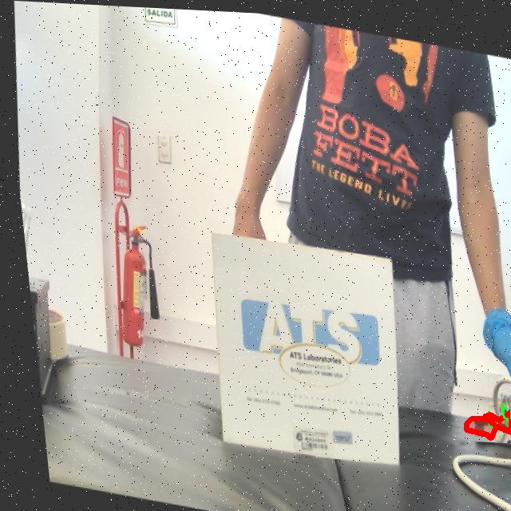

# 传感器图像分割系统源码＆数据集分享
 [yolov8-seg-C2f-ODConv＆yolov8-seg-SPDConv等50+全套改进创新点发刊_一键训练教程_Web前端展示]

### 1.研究背景与意义

项目参考[ILSVRC ImageNet Large Scale Visual Recognition Challenge](https://gitee.com/YOLOv8_YOLOv11_Segmentation_Studio/projects)

项目来源[AAAI Global Al lnnovation Contest](https://kdocs.cn/l/cszuIiCKVNis)

研究背景与意义

随着人工智能技术的迅猛发展，计算机视觉在各个领域的应用日益广泛，尤其是在图像分割和目标检测方面。YOLO（You Only Look Once）系列模型因其高效的实时处理能力和良好的检测精度，成为了研究者和工程师们的热门选择。YOLOv8作为该系列的最新版本，进一步提升了模型的性能，尤其是在复杂场景下的目标检测和分割任务中表现出色。然而，尽管YOLOv8在许多应用中取得了显著的成果，针对特定领域的图像分割需求仍然存在改进的空间。

本研究聚焦于基于改进YOLOv8的传感器图像分割系统，特别是针对“Transductores Remake”数据集的应用。该数据集包含2500幅图像，专注于传感器这一特定类别的实例分割任务。传感器在现代工业、医疗和环境监测等领域中扮演着至关重要的角色，其准确的识别和分割对于后续的数据分析和决策支持具有重要意义。通过对传感器图像的精确分割，能够有效提高系统的自动化水平，减少人工干预，从而提升工作效率和准确性。

在图像分割任务中，传统的YOLO模型在处理复杂背景、遮挡物以及多尺度目标时可能面临挑战。因此，本研究旨在通过改进YOLOv8模型，增强其在传感器图像分割中的表现。具体而言，我们将探索改进网络结构、优化损失函数和增强数据预处理等策略，以提高模型对传感器图像的分割精度和鲁棒性。此外，针对数据集中的单一类别特性，我们将设计特定的训练策略，以便更好地适应传感器图像的特征，从而提升模型的泛化能力。

本研究的意义不仅在于推动YOLOv8在实例分割领域的应用，更在于为传感器图像处理提供一种高效的解决方案。通过改进的图像分割系统，能够为相关行业提供更为精准的传感器识别和分析工具，进而推动智能制造、医疗影像分析和环境监测等领域的发展。此外，研究成果也将为后续的计算机视觉研究提供新的思路和方法，促进相关技术的进步。

综上所述，基于改进YOLOv8的传感器图像分割系统的研究，不仅具有重要的理论价值，还有着广泛的实际应用前景。通过深入探讨和实践，我们期待能够为图像分割技术的发展贡献新的力量，并为相关领域的应用提供更为高效的技术支持。

### 2.图片演示


##### 注意：由于此博客编辑较早，上面“2.图片演示”和“3.视频演示”展示的系统图片或者视频可能为老版本，新版本在老版本的基础上升级如下：（实际效果以升级的新版本为准）

  （1）适配了YOLOV8的“目标检测”模型和“实例分割”模型，通过加载相应的权重（.pt）文件即可自适应加载模型。

  （2）支持“图片识别”、“视频识别”、“摄像头实时识别”三种识别模式。

  （3）支持“图片识别”、“视频识别”、“摄像头实时识别”三种识别结果保存导出，解决手动导出（容易卡顿出现爆内存）存在的问题，识别完自动保存结果并导出到tempDir中。

  （4）支持Web前端系统中的标题、背景图等自定义修改，后面提供修改教程。

  另外本项目提供训练的数据集和训练教程,暂不提供权重文件（best.pt）,需要您按照教程进行训练后实现图片演示和Web前端界面演示的效果。

### 3.视频演示

[3.1 视频演示](https://www.bilibili.com/video/BV1A5DPYmEAA/)

### 4.数据集信息展示

##### 4.1 本项目数据集详细数据（类别数＆类别名）

nc: 1
names: ['transducer']


##### 4.2 本项目数据集信息介绍

数据集信息展示

在本研究中，我们采用了名为“Transductores Remake”的数据集，以支持对改进YOLOv8-seg传感器图像分割系统的训练与评估。该数据集专注于传感器图像的处理，特别是针对特定类别的图像分割任务。数据集的类别数量为1，涵盖了“transducer”这一单一类别，旨在为传感器图像的精确识别与分割提供充足的样本。

“Transductores Remake”数据集的构建考虑到了传感器图像在实际应用中的多样性与复杂性。数据集中包含了多种不同环境下拍摄的传感器图像，这些图像不仅包括不同类型的传感器，还涵盖了各种光照条件、背景复杂度以及传感器的不同角度和位置。这种多样性确保了模型在训练过程中能够学习到更为丰富的特征，从而提高其在实际应用中的鲁棒性和准确性。

在数据集的标注过程中，采用了精细化的标注策略，以确保每个传感器在图像中的位置和形状都得到了准确的标识。通过这种方式，数据集为YOLOv8-seg模型提供了高质量的训练样本，使得模型能够有效地学习到传感器的特征并进行准确的分割。数据集中的每一张图像都经过严格的审查与标注，确保了数据的可靠性和有效性。

此外，数据集的规模也是其重要特征之一。虽然“Transductores Remake”仅包含一个类别，但为了提升模型的泛化能力，数据集的图像数量经过精心设计，涵盖了数千张不同的传感器图像。这些图像的多样性和数量使得模型在训练过程中能够接触到各种可能的情况，从而在面对未知数据时，能够更好地进行预测和分割。

在训练过程中，我们将使用数据增强技术来进一步丰富数据集的多样性。这些技术包括随机裁剪、旋转、缩放、颜色调整等，旨在模拟不同的拍摄条件和环境变化。通过这种方式，我们希望能够提升模型的鲁棒性，使其在实际应用中能够适应不同的场景和条件。

综上所述，“Transductores Remake”数据集为改进YOLOv8-seg传感器图像分割系统的训练提供了坚实的基础。其单一类别的设计与丰富的图像样本相结合，使得该数据集在特定任务中的应用潜力巨大。通过对该数据集的深入分析与利用，我们期望能够实现更高效、更准确的传感器图像分割，从而推动相关领域的研究与应用进展。





### 5.全套项目环境部署视频教程（零基础手把手教学）

[5.1 环境部署教程链接（零基础手把手教学）](https://www.bilibili.com/video/BV1jG4Ve4E9t/?vd_source=bc9aec86d164b67a7004b996143742dc)


[5.2 安装Python虚拟环境创建和依赖库安装视频教程链接（零基础手把手教学）](https://www.bilibili.com/video/BV1nA4VeYEze/?vd_source=bc9aec86d164b67a7004b996143742dc)

### 6.手把手YOLOV8-seg训练视频教程（零基础小白有手就能学会）

[6.1 手把手YOLOV8-seg训练视频教程（零基础小白有手就能学会）](https://www.bilibili.com/video/BV1cA4VeYETe/?vd_source=bc9aec86d164b67a7004b996143742dc)


按照上面的训练视频教程链接加载项目提供的数据集，运行train.py即可开始训练



     Epoch   gpu_mem       box       obj       cls    labels  img_size
     1/200     0G   0.01576   0.01955  0.007536        22      1280: 100%|██████████| 849/849 [14:42<00:00,  1.04s/it]
               Class     Images     Labels          P          R     mAP@.5 mAP@.5:.95: 100%|██████████| 213/213 [01:14<00:00,  2.87it/s]
                 all       3395      17314      0.994      0.957      0.0957      0.0843

     Epoch   gpu_mem       box       obj       cls    labels  img_size
     2/200     0G   0.01578   0.01923  0.007006        22      1280: 100%|██████████| 849/849 [14:44<00:00,  1.04s/it]
               Class     Images     Labels          P          R     mAP@.5 mAP@.5:.95: 100%|██████████| 213/213 [01:12<00:00,  2.95it/s]
                 all       3395      17314      0.996      0.956      0.0957      0.0845

     Epoch   gpu_mem       box       obj       cls    labels  img_size
     3/200     0G   0.01561    0.0191  0.006895        27      1280: 100%|██████████| 849/849 [10:56<00:00,  1.29it/s]
               Class     Images     Labels          P          R     mAP@.5 mAP@.5:.95: 100%|███████   | 187/213 [00:52<00:00,  4.04it/s]
                 all       3395      17314      0.996      0.957      0.0957      0.0845


### 7.50+种全套YOLOV8-seg创新点代码加载调参视频教程（一键加载写好的改进模型的配置文件）

[7.1 50+种全套YOLOV8-seg创新点代码加载调参视频教程（一键加载写好的改进模型的配置文件）](https://www.bilibili.com/video/BV1Hw4VePEXv/?vd_source=bc9aec86d164b67a7004b996143742dc)

### 8.YOLOV8-seg图像分割算法原理

原始YOLOv8-seg算法原理

YOLOv8-seg算法是YOLO系列中的最新版本，旨在实现高效的目标检测与实例分割任务。自2015年YOLO模型首次提出以来，YOLO系列经历了多个版本的迭代，每个版本都在精度、速度和易用性等方面进行了显著的改进。YOLOv8作为这一系列的最新成果，结合了前几代模型的优点，并在此基础上进行了创新，形成了一个更加高效和灵活的模型结构。

YOLOv8的整体架构可以分为三个主要部分：Backbone（骨干网络）、Neck（颈部结构）和Head（头部结构）。其中，Backbone负责从输入图像中提取特征，Neck则负责将不同层次的特征进行融合，最后Head则将融合后的特征用于目标检测和分割任务。与之前的版本相比，YOLOv8在每个部分都进行了重要的改进，尤其是在特征提取和特征融合的效率上。

在Backbone部分，YOLOv8引入了新的C2f模块，替代了YOLOv5中的C3模块。C2f模块通过增加跳层连接和Split操作，显著提升了模型的梯度流动性，从而改善了特征提取的效果。此外，Backbone中的卷积层从6x6的核大小调整为3x3，这一变化不仅减少了计算量，还提高了特征提取的精度。SPPF模块的引入，使得YOLOv8能够在多尺度特征上进行更为有效的处理，增强了模型对复杂场景的适应能力。

在Neck部分，YOLOv8采用了PAN-FPN结构，这一结构通过特征金字塔网络（FPN）和路径聚合网络（PAN）相结合的方式，进一步提升了不同尺度特征的融合效果。通过有效地整合来自不同层次的特征，YOLOv8能够更好地捕捉到目标的细节信息，从而在检测和分割任务中表现出色。

Head部分的设计是YOLOv8的一大亮点。与YOLOv5的耦合头不同，YOLOv8采用了解耦的检测头，分别计算分类和回归的损失。这一设计不仅简化了模型的结构，还提高了检测的准确性。此外，YOLOv8摒弃了传统的Anchor-Based方法，转而采用Anchor-Free的检测策略，使得模型在处理不同大小的目标时更加灵活。通过这一系列的创新，YOLOv8在COCO数据集上的表现优于所有已知的目标检测与实例分割模型，成为计算机视觉领域的一个重要里程碑。

YOLOv8的另一个重要创新是其新的损失函数设计。该损失函数在计算过程中考虑了目标的类别和位置，同时引入了更为细致的权重调整机制，使得模型在训练过程中能够更好地平衡不同目标的影响。这一改进使得YOLOv8在面对复杂场景时，能够更有效地进行目标检测和分割。

在模型设置方面，YOLOv8提供了多个可调参数，如depth_factor、width_factor和ratio等。这些参数的设置使得用户可以根据具体的应用需求，对模型的深度和宽度进行灵活调整，从而在保证性能的同时，优化计算资源的使用。通过这些设置，YOLOv8不仅适用于高性能的GPU平台，也能够在较为普通的CPU环境中运行，展现出极高的兼容性和灵活性。

YOLOv8的推出，不仅在目标检测领域引发了广泛关注，也为实例分割任务提供了新的解决方案。其原生支持自定义数据集的能力，使得研究人员和开发者能够根据具体需求，快速构建和训练适合自己应用场景的模型。这一特性极大地推动了YOLOv8在各类实际应用中的普及，从智能监控到自动驾驶，从医学影像分析到工业检测，YOLOv8的应用前景广阔。

总之，YOLOv8-seg算法通过对模型结构的深度优化和创新，不仅提升了目标检测和实例分割的性能，也为计算机视觉领域的进一步发展奠定了基础。其高效的特征提取、灵活的模型设置和强大的兼容性，使得YOLOv8成为当前最具潜力的视觉算法之一，推动着智能视觉技术的不断进步。随着YOLOv8的广泛应用，我们有理由相信，它将在未来的计算机视觉研究和应用中，发挥更加重要的作用。


### 9.系统功能展示（检测对象为举例，实际内容以本项目数据集为准）

图9.1.系统支持检测结果表格显示

  图9.2.系统支持置信度和IOU阈值手动调节

  图9.3.系统支持自定义加载权重文件best.pt(需要你通过步骤5中训练获得)

  图9.4.系统支持摄像头实时识别

  图9.5.系统支持图片识别

  图9.6.系统支持视频识别

  图9.7.系统支持识别结果文件自动保存

  图9.8.系统支持Excel导出检测结果数据


### 10.50+种全套YOLOV8-seg创新点原理讲解（非科班也可以轻松写刊发刊，V11版本正在科研待更新）

#### 10.1 由于篇幅限制，每个创新点的具体原理讲解就不一一展开，具体见下列网址中的创新点对应子项目的技术原理博客网址【Blog】：


[10.1 50+种全套YOLOV8-seg创新点原理讲解链接](https://gitee.com/qunmasj/good)

#### 10.2 部分改进模块原理讲解(完整的改进原理见上图和技术博客链接)【如果此小节的图加载失败可以通过CSDN或者Github搜索该博客的标题访问原始博客，原始博客图片显示正常】

### YOLOv8简介
继YOLOv5之后,Ultralytics公司在2023年1月发布了YOLOv8,该版本可以用于执行目标检测、实例分割和图像分类任务。整个网络结构由4部分组成:输入图像, Backbone主干网络获得图像的特征图, Head检测头预测目标对象和位置, Neck融合不同层的特征并将图像特征传递到预测层。
1)相比于YOLOv5和 YOLOv7算法,YOLOv8在训练时间和检测精度上得到极大提升,而且模型的权重文件只有6 MB,可以部署到任一嵌入式设备中,它凭借自身快速、高效的性能可以很好地满足实时检测的需求。
2)由于YOLOv8算法是YOLOv5的继承版本，对应提供了N、S、 M、L、X 等不同尺度的模型,用于满足不同场景的需求,在精度得到大幅提升的同时,能流畅地训练,并且能安装在各种硬件平台上运行。
3)在输入端,YOLOv8算法使用了Mosaic数据增强[15]、自适应锚框计算[16]等方法。Mosaic数据增强是通过随机缩放、随机裁剪、随机排布的方式进行拼接,丰富检测数据集。自适应锚框计算是网络在初始锚框的基础上输出预测框,通过差值计算、反向更新等操作计算出最佳锚框值。
4)在输出端,YOLOv8算法使用解耦头替换了以往的耦合头,将分类和回归解耦为两个独立的分支,通过解耦使各个任务更加专注,从而解决复杂场景下定位不准及分类错误的问题。


### OREPA：在线卷积重参数化
卷积神经网络(CNNs)已经在许多计算机视觉任务的应用成功，包括图像分类、目标检测、语义分割等。精度和模型效率之间的权衡也已被广泛讨论。

一般来说，一个精度较高的模型通常需要一个更复杂的块，一个更宽或更深的结构。然而，这样的模型总是太重，无法部署，特别是在硬件性能有限、需要实时推理的场景下。考虑到效率，更小、更紧凑和更快的模型自然是首选。

为了获得一个部署友好且高精度的模型，有研究者提出了基于结构重参数化的方法来释放性能。在这些方法中，模型在训练阶段和推理阶段有不同的结构。具体来说，使用复杂的训练阶段拓扑，即重参数化的块，来提高性能。训练结束后，通过等效变换将一个复杂的块重参为成一个单一的线性层。重参后的模型通常具有一个整洁架构模型，例如，通常是一个类似VGG的或一个类似ResNet的结构。从这个角度来看，重参化策略可以在不引入额外的推理时间成本的情况下提高模型的性能。


BN层是重构模型的关键组成部分。在一个重新解析块(图1(b))中，在每个卷积层之后立即添加一个BN层。可以观察到，去除这些BN层会导致的性能退化。然而，当考虑到效率时，这种BN层的使用出乎意料地在训练阶段带来了巨大的计算开销。在推理阶段，复杂的块可以被压缩成一个卷积层。但是，在训练过程中，BN层是非线性的，也就是说，它们将特征映射除以它的标准差，这就阻止了合并整个块。因此，存在大量的中间计算操作(large FLOPS)和缓冲特征映射(high memory usage)。更糟糕的是，这么高的训练预算使得很难探索更复杂和可能更强的重参块。很自然地，下面的问题就出现了：

为什么标准化在重参中这么重要？

通过分析和实验，作者认为BN层中的尺度因子最重要，因为它们能够使不同分支的优化方向多样化。

基于观察结果，作者提出了在线重参化(OREPA)(图1(c))，这是一个两阶段的pipeline，使之能够简化复杂的training-time re-param block。

在第一阶段，block linearization，去除所有的非线性BN层，并引入线性缩放层。这些层与BN层具有相似的性质，因此它们使不同分支的优化多样化。此外，这些层都是线性的，可以在训练过程中合并成卷积层。

第二阶段，block squeezing，将复杂的线性块简化为单一的卷积层。OREPA通过减少由中间计算层引起的计算和存储开销，显著降低了训练成本，对性能只有非常小的影响。

此外，高效化使得探索更复杂的重参化拓扑成为可能。为了验证这一点，作者进一步提出了几个重参化的组件，以获得更好的性能。

在ImageNet分类任务上评估了所提出的OREPA。与最先进的修复模型相比，OREPA将额外的训练时间GPU内存成本降低了65%到75%，并将训练过程加快了1.5-2.3倍。同时，OREPA-ResNet和OREPA-VGG的性能始终优于+0.2%∼+0.6%之前的DBB和RepVGG方法。同时作者还评估了在下游任务上的OREPA，即目标检测和语义分割。作者发现OREPA可以在这些任务上也可以带来性能的提高。

提出了在线卷积重参化(OREPA)策略，这极大地提高了重参化模型的训练效率，并使探索更强的重参化块成为可能；

通过对重参化模型工作机制的分析，用引入的线性尺度层代替BN层，这仍然提供了不同的优化方向，并保持了表示能力;

在各种视觉任务上的实验表明，OREPA在准确性和训练效率方面都优于以前的重参化模型(DBB/RepVGG)。


#### 结构重参化
结构重参化最近被重视并应用于许多计算机视觉任务，如紧凑模型设计、架构搜索和剪枝。重参化意味着不同的架构可以通过参数的等价转换来相互转换。例如，1×1卷积的一个分支和3×3卷积的一个分支，可以转移到3×3卷积的单个分支中。在训练阶段，设计了多分支和多层拓扑来取代普通的线性层(如conv或全连接层)来增强模型。Cao等讨论了如何在训练过程中合并深度可分离卷积核。然后在推理过程中，将训练时间的复杂模型转移到简单模型中，以便于更快的推理。

在受益于复杂的training-time拓扑，同时，当前的重参化方法训练使用不可忽略的额外计算成本。当块变得更复杂以变得更强的表示时，GPU内存利用率和训练时间将会越来越长，最终走向不可接受。与以往的重参化方法不同，本文更多地关注训练成本。提出了一种通用的在线卷积重参化策略，使training-time的结构重参化成为可能。


#### Normalization
BN被提出来缓解训练非常深度神经网络时的梯度消失问题。人们认为BN层是非常重要的，因为它们平滑了损失。最近关于无BN神经网络的研究声称，BN层并不是不可或缺的。通过良好的初始化和适当的正则化，可以优雅地去除BN层。

对于重参化模型，作者认为重参化块中的BN层是关键的。无BN的变体将会出现性能下降。然而，BN层是非线性的，也就是说，它们将特征图除以它的标准差，这阻止了在线合并块。为了使在线重参化可行，作者去掉了重参块中的所有BN层，并引入了BN层的线性替代方法，即线性缩放层。

#### 卷积分解
标准卷积层计算比较密集，导致大的FLOPs和参数量。因此，卷积分解方法被提出，并广泛应用于移动设备的轻量化模型中。重参化方法也可以看作是卷积分解的某种形式，但它更倾向于更复杂的拓扑结构。本文的方法的不同之处在于，在kernel-level上分解卷积，而不是在structure level。

#### 在线重参化
在本节中，首先，分析了关键组件，即重参化模型中的BN层，在此基础上提出了在线重参化(OREPA)，旨在大大减少再参数化模型的训练时间预算。OREPA能够将复杂的训练时间块简化为一个卷积层，并保持了较高的精度。

OREPA的整体pipeline如图所示，它包括一个Block Linearization阶段和一个Block Squeezing阶段。


参考该博客通过分析多层和多分支结构的优化多样性，深入研究了重参化的有效性，并证明了所提出的线性缩放层和BN层具有相似的效果。

最后，随着训练预算的减少，进一步探索了更多的组件，以实现更强的重参化模型，成本略有增加。

#### 重参化中的Normalization
作者认为中间BN层是重参化过程中多层和多分支结构的关键组成部分。以SoTA模型DBB和RepVGG为例，去除这些层会导致严重的性能下降，如表1所示。


这种观察结果也得到了Ding等人的实验支持。因此，作者认为中间的BN层对于重参化模型的性能是必不可少的。

然而，中间BN层的使用带来了更高的训练预算。作者注意到，在推理阶段，重参化块中的所有中间操作都是线性的，因此可以合并成一个卷积层，从而形成一个简单的结构。

但在训练过程中，BN层是非线性的，即它们将特征映射除以其标准差。因此，中间操作应该单独计算，这将导致更高的计算和内存成本。更糟糕的是，如此高的成本将阻止探索更强大的训练模块。

#### Block Linearization
如3.1中所述，中间的BN层阻止了在训练过程中合并单独的层。然而，由于性能问题，直接删除它们并不简单。为了解决这一困境，作者引入了channel级线性尺度操作作为BN的线性替代方法。

缩放层包含一个可学习的向量，它在通道维度中缩放特征映射。线性缩放层具有与BN层相似的效果，它们都促进多分支向不同的方向进行优化，这是重参化时性能提高的关键。除了对性能的影响外，线性缩放层还可以在训练过程中进行合并，使在线重参化成为可能。


基于线性缩放层，作者修改了重参化块，如图所示。具体来说，块的线性化阶段由以下3个步骤组成：

首先，删除了所有的非线性层，即重参化块中的BN层

其次，为了保持优化的多样性，在每个分支的末尾添加了一个缩放层，这是BN的线性替代方法

最后，为了稳定训练过程，在所有分支的添加后添加一个BN层。

一旦完成线性化阶段，在重参化块中只存在线性层，这意味着可以在训练阶段合并块中的所有组件。

#### Block Squeezing
Block Squeezing步骤将计算和内存昂贵的中间特征映射上的操作转换为更经济的kernel上的操作。这意味着在计算和内存方面从减少到，其中、是特征图和卷积核的空间尺寸。

一般来说，无论线性重参化块是多么复杂，以下2个属性始终成立：

Block中的所有线性层，例如深度卷积、平均池化和所提出的线性缩放，都可以用带有相应参数的退化卷积层来表示;

Block可以由一系列并行分支表示，每个分支由一系列卷积层组成。

有了上述两个特性，如果可以将

多层（即顺序结构）

多分支（即并行结构）

简化为单一卷积，就可以压缩一个块。在下面的部分中，将展示如何简化顺序结构(图(a))和并行结构(图(b))。


### 11.项目核心源码讲解（再也不用担心看不懂代码逻辑）

#### 11.1 ultralytics\models\yolo\detect\predict.py

以下是对给定代码的核心部分进行提炼和详细注释的结果：

```python
# Ultralytics YOLO 🚀, AGPL-3.0 license

from ultralytics.engine.predictor import BasePredictor
from ultralytics.engine.results import Results
from ultralytics.utils import ops

class DetectionPredictor(BasePredictor):
    """
    DetectionPredictor类扩展了BasePredictor类，用于基于检测模型进行预测。
    """

    def postprocess(self, preds, img, orig_imgs):
        """
        对预测结果进行后处理，并返回Results对象的列表。

        参数:
        preds: 模型的预测结果
        img: 输入图像
        orig_imgs: 原始图像列表或张量

        返回:
        results: 包含每个预测结果的Results对象列表
        """
        # 应用非极大值抑制（NMS）来过滤重叠的检测框
        preds = ops.non_max_suppression(preds,
                                         self.args.conf,  # 置信度阈值
                                         self.args.iou,   # IOU阈值
                                         agnostic=self.args.agnostic_nms,  # 是否使用类别无关的NMS
                                         max_det=self.args.max_det,  # 最大检测框数量
                                         classes=self.args.classes)  # 选择的类别

        # 如果输入的原始图像不是列表，则将其转换为numpy数组
        if not isinstance(orig_imgs, list):  # 输入图像是torch.Tensor而不是列表
            orig_imgs = ops.convert_torch2numpy_batch(orig_imgs)

        results = []  # 存储结果的列表
        for i, pred in enumerate(preds):  # 遍历每个预测结果
            orig_img = orig_imgs[i]  # 获取对应的原始图像
            # 将预测框的坐标从缩放后的图像空间转换回原始图像空间
            pred[:, :4] = ops.scale_boxes(img.shape[2:], pred[:, :4], orig_img.shape)
            img_path = self.batch[0][i]  # 获取图像路径
            # 创建Results对象并添加到结果列表中
            results.append(Results(orig_img, path=img_path, names=self.model.names, boxes=pred))
        return results  # 返回结果列表
```

### 代码分析：
1. **类定义**：`DetectionPredictor` 继承自 `BasePredictor`，用于实现目标检测的预测功能。
2. **后处理方法**：`postprocess` 方法对模型的预测结果进行后处理，主要包括非极大值抑制（NMS）和坐标转换。
3. **非极大值抑制**：通过 `ops.non_max_suppression` 函数来过滤掉重叠的检测框，确保每个目标只保留一个最优框。
4. **图像转换**：如果原始图像不是列表形式，则将其转换为numpy数组，以便后续处理。
5. **结果构建**：遍历每个预测结果，调整框的坐标并创建 `Results` 对象，最终返回所有结果的列表。

### 重要性：
这个类是YOLO模型进行目标检测的核心部分，后处理步骤对于提高检测精度和减少冗余结果至关重要。

这个文件是Ultralytics YOLO（You Only Look Once）模型的一部分，主要用于目标检测的预测功能。它定义了一个名为`DetectionPredictor`的类，该类继承自`BasePredictor`，并实现了对检测模型的预测。

在类的文档字符串中，提供了一个使用示例，展示了如何导入`DetectionPredictor`并使用它进行预测。示例中，首先从Ultralytics的工具中导入必要的模块，然后定义了一个包含模型路径和数据源的参数字典，接着创建了`DetectionPredictor`的实例，并调用`predict_cli`方法进行预测。

类中的`postprocess`方法是核心功能之一，负责对模型的预测结果进行后处理。具体来说，它接收预测结果`preds`、输入图像`img`和原始图像`orig_imgs`作为参数。首先，使用非极大值抑制（Non-Maximum Suppression, NMS）对预测结果进行筛选，以消除冗余的检测框。这个过程考虑了置信度阈值、IOU（Intersection Over Union）阈值、是否使用类无关的NMS、最大检测数量以及需要检测的类别。

接下来，方法检查输入的原始图像是否为列表，如果不是，则将其转换为NumPy数组。然后，方法遍历每个预测结果，调整检测框的坐标以适应原始图像的尺寸，并将每个结果封装成`Results`对象，包含原始图像、图像路径、模型名称和检测框信息。最后，返回一个包含所有结果的列表。

整体来看，这个文件实现了YOLO模型的预测功能，并提供了对预测结果的后处理，确保输出的结果能够用于后续的分析或可视化。

#### 11.2 ultralytics\utils\downloads.py

以下是经过简化和注释的核心代码部分，主要包括文件下载、解压缩和检查磁盘空间的功能。

```python
import requests
import shutil
from pathlib import Path
from zipfile import ZipFile, is_zipfile
from tqdm import tqdm  # 进度条库

def check_disk_space(url='https://ultralytics.com/assets/coco128.zip', sf=1.5, hard=True):
    """
    检查下载文件所需的磁盘空间是否足够。

    Args:
        url (str): 要下载的文件的URL。
        sf (float): 安全因子，所需可用空间的倍数。
        hard (bool): 是否在磁盘空间不足时抛出错误。

    Returns:
        bool: 如果有足够的磁盘空间则返回True，否则返回False。
    """
    try:
        r = requests.head(url)  # 发送HEAD请求获取文件信息
        assert r.status_code < 400, f'URL error for {url}: {r.status_code} {r.reason}'  # 检查响应状态
    except Exception:
        return True  # 请求出现问题，默认返回True

    # 获取文件大小和磁盘使用情况
    gib = 1 << 30  # 每GiB的字节数
    data = int(r.headers.get('Content-Length', 0)) / gib  # 文件大小（GB）
    total, used, free = (x / gib for x in shutil.disk_usage('/'))  # 获取磁盘使用情况
    if data * sf < free:
        return True  # 有足够的空间

    # 空间不足的警告
    text = (f'WARNING ⚠️ Insufficient free disk space {free:.1f} GB < {data * sf:.3f} GB required.')
    if hard:
        raise MemoryError(text)  # 抛出内存错误
    print(text)  # 打印警告信息
    return False

def safe_download(url, file=None, dir=None, unzip=True, delete=False, retry=3, progress=True):
    """
    从URL下载文件，并可选择解压缩和删除下载的文件。

    Args:
        url (str): 要下载的文件的URL。
        file (str): 下载后保存的文件名。
        dir (str): 保存下载文件的目录。
        unzip (bool): 是否解压缩下载的文件。
        delete (bool): 是否在解压缩后删除下载的文件。
        retry (int): 下载失败时的重试次数。
        progress (bool): 是否显示下载进度条。
    """
    f = Path(dir) / file if dir else Path(file)  # 确定文件保存路径
    if not f.is_file():  # 如果文件不存在
        print(f"Downloading {url} to '{f}'...")  # 打印下载信息
        f.parent.mkdir(parents=True, exist_ok=True)  # 创建目录
        check_disk_space(url)  # 检查磁盘空间
        for i in range(retry + 1):
            try:
                # 使用requests下载文件
                with requests.get(url, stream=True) as response:
                    response.raise_for_status()  # 检查请求是否成功
                    total_size = int(response.headers.get('Content-Length', 0))  # 获取文件总大小
                    with open(f, 'wb') as f_opened:
                        for data in tqdm(response.iter_content(chunk_size=8192), total=total_size // 8192, unit='KB', disable=not progress):
                            f_opened.write(data)  # 写入文件
                break  # 下载成功，退出循环
            except Exception as e:
                if i >= retry:
                    print(f"Download failed after {retry} retries.")  # 打印失败信息
                    raise e  # 抛出异常

    # 解压缩文件
    if unzip and f.exists() and f.suffix in ('.zip', '.tar', '.gz'):
        unzip_dir = dir or f.parent  # 解压缩目录
        if is_zipfile(f):
            with ZipFile(f) as zipObj:
                zipObj.extractall(unzip_dir)  # 解压缩
        if delete:
            f.unlink()  # 删除下载的文件

# 示例调用
# safe_download('https://example.com/file.zip', file='file.zip', dir='downloads')
```

### 代码说明：
1. **check_disk_space**: 该函数检查指定URL的文件是否可以在本地磁盘上下载。它会检查当前磁盘的可用空间是否足够，并根据需要抛出错误或打印警告。

2. **safe_download**: 该函数负责从给定的URL下载文件，并可以选择解压缩和删除下载的文件。它支持重试机制，并在下载过程中显示进度条。

3. **进度条**: 使用`tqdm`库来显示下载进度，增强用户体验。

4. **文件处理**: 代码中使用`Path`类来处理文件路径，确保代码的可读性和可维护性。

这个程序文件`ultralytics/utils/downloads.py`主要用于处理文件的下载、解压和管理，特别是与Ultralytics YOLO（一个流行的目标检测模型）相关的资源。文件中包含多个函数，每个函数负责特定的任务。

首先，文件导入了一些必要的库，包括处理文件路径的`Path`、进行网络请求的`requests`、以及用于多线程下载的`ThreadPool`等。它还定义了一些与Ultralytics GitHub资源相关的常量，例如模型文件的名称和基本路径。

`is_url`函数用于检查给定字符串是否为有效的URL，并可选地检查该URL是否存在。`delete_dsstore`函数用于删除特定目录下的`.DS_Store`文件，这些文件是macOS系统生成的隐藏文件，可能在跨平台文件传输时造成问题。

`zip_directory`和`unzip_file`函数分别用于将目录压缩为ZIP文件和解压ZIP文件。它们支持排除特定文件，并可以显示进度条。`check_disk_space`函数用于检查下载文件所需的磁盘空间是否足够，确保在下载前有足够的空间。

`get_google_drive_file_info`函数用于处理Google Drive的共享链接，提取直接下载链接和文件名。`safe_download`函数是下载文件的核心功能，支持从URL下载文件，处理Google Drive链接，检查磁盘空间，支持重试机制，并可以选择在下载后解压文件。

`get_github_assets`函数用于从GitHub获取指定版本的资源文件信息，而`attempt_download_asset`函数则尝试从GitHub下载指定的文件，如果本地不存在的话。最后，`download`函数则提供了一个高层次的接口，可以选择并发下载多个文件。

总体来说，这个文件提供了一系列实用的工具函数，旨在简化与文件下载和管理相关的操作，特别是在使用YOLO模型时，方便用户获取和管理所需的模型文件和数据集。

#### 11.3 ultralytics\models\rtdetr\__init__.py

以下是代码中最核心的部分，并附上详细的中文注释：

```python
# 导入RTDETR模型、预测器和验证器
from .model import RTDETR  # 导入RTDETR模型类
from .predict import RTDETRPredictor  # 导入RTDETR预测器类
from .val import RTDETRValidator  # 导入RTDETR验证器类

# 定义模块的公开接口，允许外部使用这些类
__all__ = 'RTDETRPredictor', 'RTDETRValidator', 'RTDETR'
```

### 注释说明：
1. **导入模块**：
   - `from .model import RTDETR`：从当前包的`model`模块中导入`RTDETR`类，`RTDETR`是一个模型类，通常用于定义目标检测模型的结构和参数。
   - `from .predict import RTDETRPredictor`：从当前包的`predict`模块中导入`RTDETRPredictor`类，`RTDETRPredictor`用于对输入数据进行预测，返回检测结果。
   - `from .val import RTDETRValidator`：从当前包的`val`模块中导入`RTDETRValidator`类，`RTDETRValidator`用于验证模型的性能，通常在训练后评估模型的准确性。

2. **定义公开接口**：
   - `__all__ = 'RTDETRPredictor', 'RTDETRValidator', 'RTDETR'`：这是一个特殊变量，用于定义当使用`from module import *`时，哪些类是可以被导入的。这里列出了`RTDETRPredictor`、`RTDETRValidator`和`RTDETR`，表示这些类是模块的公共接口，用户可以直接使用。

这个程序文件是一个Python模块的初始化文件，文件名为`__init__.py`，位于`ultralytics\models\rtdetr`目录下。它的主要功能是定义模块的公共接口，并导入该模块中的主要类和功能。

首先，文件顶部的注释部分表明这个项目是Ultralytics YOLO的一部分，并且遵循AGPL-3.0许可证。这说明该项目是开源的，用户在使用和修改代码时需要遵循相应的许可证条款。

接下来，文件通过`from .model import RTDETR`语句导入了`model`模块中的`RTDETR`类。这个类可能是与目标检测相关的模型实现，具体功能可以在`model.py`文件中找到。

然后，文件又通过`from .predict import RTDETRPredictor`导入了`predict`模块中的`RTDETRPredictor`类。这个类的作用通常是用于进行模型预测，即使用训练好的模型对新数据进行推断。

最后，文件还导入了`val`模块中的`RTDETRValidator`类，通常用于模型验证和评估，帮助用户了解模型在测试集上的表现。

在文件的末尾，`__all__`变量被定义为一个包含字符串的元组，列出了该模块的公共接口。这意味着当使用`from ultralytics.models.rtdetr import *`语句时，只会导入`RTDETRPredictor`、`RTDETRValidator`和`RTDETR`这三个类。这样做的目的是为了控制模块的命名空间，避免不必要的名称冲突，同时使得模块的使用更加清晰和简洁。

总体来说，这个`__init__.py`文件的作用是组织和简化模块的结构，使得用户可以方便地访问和使用与RTDETR相关的功能。

#### 11.4 ultralytics\models\sam\modules\sam.py

以下是经过简化和注释的核心代码部分：

```python
import torch
from torch import nn
from typing import List

class Sam(nn.Module):
    """
    Sam (Segment Anything Model) 是一个用于对象分割任务的模型。它使用图像编码器生成图像嵌入，并使用提示编码器对各种输入提示进行编码。然后，这些嵌入被掩码解码器用于预测对象掩码。
    """
    
    # 掩码预测的阈值
    mask_threshold: float = 0.0
    # 输入图像的格式，默认为 'RGB'
    image_format: str = 'RGB'

    def __init__(
        self,
        image_encoder: ImageEncoderViT,  # 图像编码器，用于将图像编码为嵌入
        prompt_encoder: PromptEncoder,    # 提示编码器，用于编码输入提示
        mask_decoder: MaskDecoder,        # 掩码解码器，从图像嵌入和编码的提示中预测掩码
        pixel_mean: List[float] = (123.675, 116.28, 103.53),  # 图像归一化的均值
        pixel_std: List[float] = (58.395, 57.12, 57.375)       # 图像归一化的标准差
    ) -> None:
        """
        初始化 Sam 类，以从图像和输入提示中预测对象掩码。

        参数:
            image_encoder (ImageEncoderViT): 用于将图像编码为图像嵌入的主干网络。
            prompt_encoder (PromptEncoder): 编码各种类型的输入提示。
            mask_decoder (MaskDecoder): 从图像嵌入和编码的提示中预测掩码。
            pixel_mean (List[float], optional): 输入图像的像素归一化均值，默认为 (123.675, 116.28, 103.53)。
            pixel_std (List[float], optional): 输入图像的像素归一化标准差，默认为 (58.395, 57.12, 57.375)。
        """
        super().__init__()  # 调用父类的初始化方法
        self.image_encoder = image_encoder  # 初始化图像编码器
        self.prompt_encoder = prompt_encoder  # 初始化提示编码器
        self.mask_decoder = mask_decoder  # 初始化掩码解码器
        # 注册图像归一化的均值和标准差为缓冲区，不会在模型参数中更新
        self.register_buffer('pixel_mean', torch.Tensor(pixel_mean).view(-1, 1, 1), False)
        self.register_buffer('pixel_std', torch.Tensor(pixel_std).view(-1, 1, 1), False)
```

### 代码说明：
1. **类定义**：`Sam`类继承自`nn.Module`，用于实现一个对象分割模型。
2. **属性**：
   - `mask_threshold`：用于掩码预测的阈值。
   - `image_format`：指定输入图像的格式。
3. **初始化方法**：
   - 接收图像编码器、提示编码器和掩码解码器作为参数。
   - 允许用户指定图像归一化的均值和标准差。
   - 使用`register_buffer`方法将均值和标准差注册为模型的缓冲区，以便在模型的前向传播中使用，但不作为可训练参数。

这个程序文件定义了一个名为 `Sam` 的类，属于 Ultralytics YOLO 项目的一部分，主要用于对象分割任务。`Sam` 类继承自 PyTorch 的 `nn.Module`，它的设计目的是通过图像编码器生成图像嵌入，并通过提示编码器对不同类型的输入提示进行编码，最终利用掩码解码器预测对象的掩码。

在类的属性中，`mask_threshold` 是用于掩码预测的阈值，`image_format` 则指定了输入图像的格式，默认为 'RGB'。`image_encoder` 是一个图像编码器，负责将图像转换为嵌入表示；`prompt_encoder` 用于编码各种输入提示；`mask_decoder` 则根据图像和提示的嵌入来预测对象的掩码。此外，`pixel_mean` 和 `pixel_std` 分别用于图像归一化的均值和标准差。

在 `__init__` 方法中，类的初始化接受三个主要参数：`image_encoder`、`prompt_encoder` 和 `mask_decoder`，它们分别对应于图像编码、提示编码和掩码解码的功能。`pixel_mean` 和 `pixel_std` 是可选参数，用于设置输入图像的归一化参数，默认值已给出。

通过调用 `super().__init__()`，初始化父类的构造函数，确保 `Sam` 类能够正确地继承 `nn.Module` 的所有功能。`register_buffer` 方法用于注册均值和标准差张量，这样它们可以在模型训练和推理过程中保持不变。

总体而言，这个类为实现对象分割提供了基础结构，结合图像和提示信息来生成准确的分割掩码。

#### 11.5 ultralytics\engine\exporter.py

以下是经过简化和注释的代码，保留了核心部分并进行了详细的中文注释：

```python
import json
import os
import shutil
import subprocess
import time
import warnings
from copy import deepcopy
from datetime import datetime
from pathlib import Path
import torch
from ultralytics.cfg import get_cfg
from ultralytics.utils import select_device, smart_inference_mode

class Exporter:
    """
    模型导出类，用于将YOLOv8模型导出为不同格式。
    """

    def __init__(self, cfg='default_cfg.yaml', overrides=None):
        """
        初始化Exporter类。

        参数:
            cfg (str): 配置文件路径，默认为'default_cfg.yaml'。
            overrides (dict): 配置覆盖项，默认为None。
        """
        self.args = get_cfg(cfg, overrides)  # 获取配置
        self.callbacks = []  # 初始化回调列表

    @smart_inference_mode()
    def __call__(self, model=None):
        """执行模型导出并返回导出文件列表。"""
        self.run_callbacks('on_export_start')  # 开始导出回调
        t = time.time()  # 记录开始时间

        # 选择设备
        self.device = select_device('cpu' if self.args.device is None else self.args.device)

        # 检查模型
        model = deepcopy(model).to(self.device)  # 深拷贝模型并移动到指定设备
        model.eval()  # 设置模型为评估模式

        # 创建输入张量
        im = torch.zeros(self.args.batch, 3, *self.args.imgsz).to(self.device)

        # 执行导出
        f = self.export_onnx(model, im)  # 导出为ONNX格式

        # 完成导出
        self.run_callbacks('on_export_end')  # 结束导出回调
        return f  # 返回导出文件路径

    def export_onnx(self, model, im):
        """导出为ONNX格式。"""
        f = Path('model.onnx')  # 指定导出文件名
        torch.onnx.export(
            model.cpu(),  # 将模型移动到CPU
            im.cpu(),  # 将输入张量移动到CPU
            f,  # 导出文件路径
            input_names=['images'],  # 输入名称
            output_names=['output0'],  # 输出名称
            dynamic_axes={'images': {0: 'batch', 2: 'height', 3: 'width'}}  # 动态轴
        )
        return f  # 返回导出文件路径

    def run_callbacks(self, event: str):
        """执行给定事件的所有回调。"""
        for callback in self.callbacks:
            callback(self)  # 执行回调

# 使用示例
if __name__ == "__main__":
    exporter = Exporter()  # 创建Exporter实例
    model = torch.load('yolov8n.pt')  # 加载YOLOv8模型
    exported_file = exporter(model)  # 导出模型
    print(f"模型已导出到: {exported_file}")
```

### 代码说明：
1. **导入必要的库**：引入了处理文件、时间、深度学习框架等所需的库。
2. **Exporter类**：这是主要的导出类，负责处理模型的导出逻辑。
   - `__init__`方法：初始化配置和回调。
   - `__call__`方法：执行导出操作，返回导出文件路径。
   - `export_onnx`方法：将模型导出为ONNX格式。
   - `run_callbacks`方法：执行与导出相关的回调函数。
3. **使用示例**：在主程序中创建Exporter实例，加载模型并执行导出。

这个程序文件 `exporter.py` 是 Ultralytics YOLOv8 模型的导出模块，主要用于将训练好的 YOLOv8 PyTorch 模型导出为多种格式，以便在不同的环境和平台上进行推理。文件中包含了多种导出格式的支持，包括 PyTorch、TorchScript、ONNX、OpenVINO、TensorRT、CoreML、TensorFlow SavedModel、TensorFlow GraphDef、TensorFlow Lite、TensorFlow Edge TPU、TensorFlow.js、PaddlePaddle 和 ncnn。

文件开头提供了支持的导出格式的列表，以及相应的命令行和 Python API 使用示例。接着，文件中定义了一些辅助函数和类，用于处理模型导出过程中的各种任务。

`export_formats` 函数返回一个包含所有支持的导出格式的 DataFrame，方便查看和管理。`gd_outputs` 函数用于获取 TensorFlow GraphDef 模型的输出节点名称。

`try_export` 是一个装饰器，用于包装导出函数，以便在导出过程中捕获异常并记录日志。`Exporter` 类是核心类，负责管理模型的导出过程。它的构造函数接受配置文件路径和回调函数，并初始化导出参数。

在 `__call__` 方法中，首先运行导出开始的回调函数，然后根据指定的格式进行导出。方法中会检查输入参数的有效性，设置设备（CPU 或 GPU），并进行必要的模型和输入检查。然后，通过调用不同的导出方法（如 `export_torchscript`、`export_onnx` 等）来完成模型的导出。

每个导出方法（如 `export_torchscript`、`export_onnx` 等）都使用 `try_export` 装饰器进行装饰，以确保在导出过程中发生的任何异常都能被捕获并记录。每个导出方法的实现逻辑各不相同，针对不同的格式进行相应的处理，包括模型的转换、优化和保存。

例如，`export_onnx` 方法会使用 PyTorch 的 `torch.onnx.export` 函数将模型导出为 ONNX 格式，并支持动态输入形状的设置。`export_coreml` 方法则会使用 `coremltools` 库将模型导出为 CoreML 格式，并处理模型的量化和 NMS（非极大值抑制）配置。

最后，文件中还定义了一些辅助类和方法，如 `IOSDetectModel`，用于在 CoreML 导出时对 YOLO 模型进行封装，以便适应 iOS 平台的需求。

总的来说，这个文件实现了 YOLOv8 模型的多种格式导出功能，便于用户在不同的推理环境中使用训练好的模型。

### 12.系统整体结构（节选）

### 整体功能和构架概括

Ultralytics YOLO 项目是一个强大的目标检测和分割框架，主要基于 YOLO（You Only Look Once）模型。该项目的整体功能涵盖了模型的训练、推理、导出和数据处理等多个方面。通过模块化的设计，项目将不同的功能划分到各个文件中，使得代码结构清晰且易于维护。

- **模型预测**：通过 `predict.py` 文件实现对训练好的 YOLO 模型进行推理，处理输入图像并生成检测结果。
- **文件下载和管理**：`downloads.py` 文件提供了下载模型和数据集的工具，支持从 GitHub 和 Google Drive 等平台获取资源。
- **模块初始化**：`__init__.py` 文件用于组织 RTDETR 模型相关的类和功能，简化模块的导入。
- **对象分割**：`sam.py` 文件实现了一个用于对象分割的核心类，结合图像和提示信息生成分割掩码。
- **模型导出**：`exporter.py` 文件负责将训练好的模型导出为多种格式，以便在不同的推理环境中使用。

### 文件功能整理表

| 文件路径                                           | 功能描述                                                     |
|----------------------------------------------------|------------------------------------------------------------|
| `ultralytics/models/yolo/detect/predict.py`       | 实现 YOLO 模型的预测功能，处理输入图像并生成检测结果。    |
| `ultralytics/utils/downloads.py`                  | 提供文件下载和管理工具，支持从多个平台下载模型和数据集。  |
| `ultralytics/models/rtdetr/__init__.py`           | 定义 RTDETR 模型的公共接口，导入主要类和功能。            |
| `ultralytics/models/sam/modules/sam.py`           | 实现对象分割的核心类，结合图像和提示生成分割掩码。        |
| `ultralytics/engine/exporter.py`                  | 负责将训练好的模型导出为多种格式，便于在不同环境中推理。  |

这个表格清晰地总结了每个文件的功能，帮助理解 Ultralytics YOLO 项目的整体架构和各个模块之间的关系。

注意：由于此博客编辑较早，上面“11.项目核心源码讲解（再也不用担心看不懂代码逻辑）”中部分代码可能会优化升级，仅供参考学习，完整“训练源码”、“Web前端界面”和“50+种创新点源码”以“14.完整训练+Web前端界面+50+种创新点源码、数据集获取”的内容为准。

### 13.图片、视频、摄像头图像分割Demo(去除WebUI)代码

在这个博客小节中，我们将讨论如何在不使用WebUI的情况下，实现图像分割模型的使用。本项目代码已经优化整合，方便用户将分割功能嵌入自己的项目中。
核心功能包括图片、视频、摄像头图像的分割，ROI区域的轮廓提取、类别分类、周长计算、面积计算、圆度计算以及颜色提取等。
这些功能提供了良好的二次开发基础。

### 核心代码解读

以下是主要代码片段，我们会为每一块代码进行详细的批注解释：

```python
import random
import cv2
import numpy as np
from PIL import ImageFont, ImageDraw, Image
from hashlib import md5
from model import Web_Detector
from chinese_name_list import Label_list

# 根据名称生成颜色
def generate_color_based_on_name(name):
    ......

# 计算多边形面积
def calculate_polygon_area(points):
    return cv2.contourArea(points.astype(np.float32))

...
# 绘制中文标签
def draw_with_chinese(image, text, position, font_size=20, color=(255, 0, 0)):
    image_pil = Image.fromarray(cv2.cvtColor(image, cv2.COLOR_BGR2RGB))
    draw = ImageDraw.Draw(image_pil)
    font = ImageFont.truetype("simsun.ttc", font_size, encoding="unic")
    draw.text(position, text, font=font, fill=color)
    return cv2.cvtColor(np.array(image_pil), cv2.COLOR_RGB2BGR)

# 动态调整参数
def adjust_parameter(image_size, base_size=1000):
    max_size = max(image_size)
    return max_size / base_size

# 绘制检测结果
def draw_detections(image, info, alpha=0.2):
    name, bbox, conf, cls_id, mask = info['class_name'], info['bbox'], info['score'], info['class_id'], info['mask']
    adjust_param = adjust_parameter(image.shape[:2])
    spacing = int(20 * adjust_param)

    if mask is None:
        x1, y1, x2, y2 = bbox
        aim_frame_area = (x2 - x1) * (y2 - y1)
        cv2.rectangle(image, (x1, y1), (x2, y2), color=(0, 0, 255), thickness=int(3 * adjust_param))
        image = draw_with_chinese(image, name, (x1, y1 - int(30 * adjust_param)), font_size=int(35 * adjust_param))
        y_offset = int(50 * adjust_param)  # 类别名称上方绘制，其下方留出空间
    else:
        mask_points = np.concatenate(mask)
        aim_frame_area = calculate_polygon_area(mask_points)
        mask_color = generate_color_based_on_name(name)
        try:
            overlay = image.copy()
            cv2.fillPoly(overlay, [mask_points.astype(np.int32)], mask_color)
            image = cv2.addWeighted(overlay, 0.3, image, 0.7, 0)
            cv2.drawContours(image, [mask_points.astype(np.int32)], -1, (0, 0, 255), thickness=int(8 * adjust_param))

            # 计算面积、周长、圆度
            area = cv2.contourArea(mask_points.astype(np.int32))
            perimeter = cv2.arcLength(mask_points.astype(np.int32), True)
            ......

            # 计算色彩
            mask = np.zeros(image.shape[:2], dtype=np.uint8)
            cv2.drawContours(mask, [mask_points.astype(np.int32)], -1, 255, -1)
            color_points = cv2.findNonZero(mask)
            ......

            # 绘制类别名称
            x, y = np.min(mask_points, axis=0).astype(int)
            image = draw_with_chinese(image, name, (x, y - int(30 * adjust_param)), font_size=int(35 * adjust_param))
            y_offset = int(50 * adjust_param)

            # 绘制面积、周长、圆度和色彩值
            metrics = [("Area", area), ("Perimeter", perimeter), ("Circularity", circularity), ("Color", color_str)]
            for idx, (metric_name, metric_value) in enumerate(metrics):
                ......

    return image, aim_frame_area

# 处理每帧图像
def process_frame(model, image):
    pre_img = model.preprocess(image)
    pred = model.predict(pre_img)
    det = pred[0] if det is not None and len(det)
    if det:
        det_info = model.postprocess(pred)
        for info in det_info:
            image, _ = draw_detections(image, info)
    return image

if __name__ == "__main__":
    cls_name = Label_list
    model = Web_Detector()
    model.load_model("./weights/yolov8s-seg.pt")

    # 摄像头实时处理
    cap = cv2.VideoCapture(0)
    while cap.isOpened():
        ret, frame = cap.read()
        if not ret:
            break
        ......

    # 图片处理
    image_path = './icon/OIP.jpg'
    image = cv2.imread(image_path)
    if image is not None:
        processed_image = process_frame(model, image)
        ......

    # 视频处理
    video_path = ''  # 输入视频的路径
    cap = cv2.VideoCapture(video_path)
    while cap.isOpened():
        ret, frame = cap.read()
        ......
```


### 14.完整训练+Web前端界面+50+种创新点源码、数据集获取


# [下载链接：https://mbd.pub/o/bread/Zp6bkp9u](https://mbd.pub/o/bread/Zp6bkp9u)